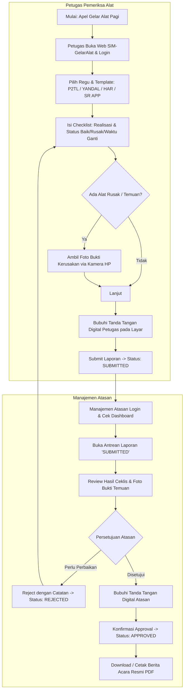

# PRODUCT REQUIREMENT DOCUMENT (PRD)
## SISTEM INFORMASI DIGITALISASI GELAR ALAT & K3 (P2TL, YANDAL, HAR, SR APP)

- **Nama Produk:** Sistem Monitoring & Digital Gelar Alat (SIM-GelarAlat)
- **Target Platform:** Web Application (Mobile-friendly / Responsive)
- **Teknologi Utama:** PHP Native (PDO / OOP), MySQL / MariaDB, HTML5, Vanilla CSS / Bootstrap 5, JavaScript (Signature Pad & Camera API)
- **Status Dokumen:** Draft v1.0
- **Tanggal:** September 2026

---


## 1. Executive Summary & Latar Belakang

### 1.1 Latar Belakang
Kegiatan **Gelar Pasukan dan Peralatan (Gelar Alat)** merupakan rutinitas operasional wajib di lingkungan unit kerja kelistrikan (PLN & Mitra Kerja / Pemborong) untuk memastikan:
1. Kesiapan peralatan kerja (*working tools*).
2. Kelengkapan dan kelaikan Alat Pelindung Diri (APD) dan Alat K3 beregu.
3. Kelaikan armada kendaraan operasional (Roda 2, Roda 3, Mobil Yandal/Truk Har).
4. Kesiapan personel pelaksana.

Berdasarkan dokumen eksisting yang dilampirkan, terdapat 3 variasi form checklist utama:
1. **Berita Acara Gelar Pasukan & Peralatan Pekerjaan P2TL** (Format PT Citacontrac - ULP Balong / UP3 Ponorogo).
2. **Checklist Peralatan Jasa Penyambungan & Pembongkaran SR APP 1 Phasa** (Dilengkapi referensi gambar alat, kategori Regu Roda 3 & Roda 2).
3. **Checklist Sarana Peralatan Kerja dan Kendaraan** (Mobil Yandal Hilux Rangga, Verza ULC, Truk Hino Har A, Carry Har B) dengan standar kuantitas (*JML STD*), *Realisasi*, *Kondisi* (Baik/Rusak), dan *Keterangan*.

### 1.2 Masalah Saat Ini (Pain Points)
- **Pencatatan Manual Berbasis Kertas:** Formulir rentan robek, basah saat inspeksi lapangan, atau hilang.
- **Kesulitan Arsip & Penelusuran:** Sulit mencari riwayat pemeriksaan masa lalu jika ada audit K3 atau insiden kerja.
- **Keterlambatan Tindak Lanjut Alat Rusak:** Catatan alat rusak (contoh: *"Waktu Ganti Rusak"*) tidak otomatis menjadi tiket penggantian/kalibrasi.
- **Validasi Multi-Pihak:** Proses paraf/tanda tangan basah antara Pengawas K3, Team Leader (TL), SPV Yantek, dan Manager ULP memakan waktu dan birokrasi manual.

### 1.3 Solusi yang Ditawarkan
Membangun aplikasi web berbasis **PHP Native** yang ringan, mudah di-*host* di server lokal (Laragon/XAMPP) maupun VPS, dengan fokus:
- Formulir digital yang sesuai dengan format fisik aslinya.
- Dukungan tanda tangan digital langsung di layar HP/tablet/laptop.
- Fitur unggah bukti foto kondisi alat (terutama jika rusak/perlu diganti).
- Ekspor PDF otomatis dengan tampilan resmi yang presisi menyerupai dokumen fisik.

---

## 2. Tujuan & Indikator Keberhasilan (KPI)

### 2.1 Tujuan Produk
1. Mengubah proses inspeksi gelar alat dari kertas (*paperless*) menjadi formulir digital interaktif.
2. Memfasilitasi fleksibilitas template checklist sesuai jenis regu/divisi (P2TL, SR APP 1 Phasa, Yandal, Pemeliharaan/HAR).
3. Menyediakan histori kepatuhan inspeksi dan kondisi aset peralatan secara transparan.

### 2.2 KPI (Key Performance Indicators)
- **100% Paperless Inspection:** Seluruh checklist mingguan/bulanan dicatat lewat sistem.
- **Kecepatan Pengesahan:** Tanda tangan validasi (Petugas Pemeriksa -> Manajemen Atasan) selesai dalam waktu cepat (< 30 menit) setelah gelar alat.
- **Early Warning:** Deteksi dini alat rusak/kadaluarsa kalibrasi langsung terlihat pada dashboard peringatan.

---

## 3. Persona Pengguna & Hak Akses (Role & Permission)

Sistem dirancang khusus dengan **2 Role Utama**:

| Role | Deskripsi & Tanggung Jawab | Hak Akses Utama |
| :--- | :--- | :--- |
| **1. Petugas Pemeriksa Alat** *(Field Inspector)* | Personel lapangan / anggota regu pelaksana inspeksi gelar alat (P2TL, Yandal, HAR, SR APP). | - Mengakses form checklist gelar alat (mobile-friendly).<br>- Memilih jenis regu, armada kendaraan, dan mengisi nama personel regu.<br>- Mengisi kuantitas realisasi dan memilih status kelaikan alat (*Baik*, *Rusak*, *Waktu Ganti*, *Ada/Tidak Ada*).<br>- Mengunggah foto bukti temuan fisik / alat rusak langsung dari kamera HP.<br>- Membubuhkan **tanda tangan digital pelaksana** pada canvas.<br>- Mengirimkan (*Submit*) laporan inspeksi ke Manajemen Atasan.<br>- Melihat histori pemeriksaan yang pernah dibuatnya. |
| **2. Manajemen Atasan** *(Supervisor & Approver)* | Pimpinan dan pengawas teknis (mencakup peran Manager ULP, SPV Yantek, Team Leader (TL) Teknik/PP, dan Pengawas K3/K3L). | - Mengakses **Dashboard Monitoring**: melihat ringkasan gelar alat hari ini, rekapitulasi kepatuhan regu, dan daftar alat rusak (*Red Flag*).<br>- Meninjau (*Review*) detail laporan gelar alat yang diajukan petugas.<br>- Memvalidasi & membubuhkan **tanda tangan digital manajemen/atasan** secara langsung.<br>- Menyetujui (*Approve*) atau mengembalikan (*Reject with Notes*) laporan jika ada yang belum sesuai.<br>- Mengunduh dan mencetak Berita Acara resmi format PDF/kertas standar.<br>- Mengelola Master Data: daftar peralatan, standar kuantitas, data armada/regu, dan akun pengguna. |

---

## 4. Analisis Dokumen & Kebutuhan Template Checklist

Sistem harus mendukung **4 Template Utama** sesuai dokumen fisik:

### Template 1: P2TL (Penertiban Pemakaian Tenaga Listrik)
- **Atribut Header:** No. Dokumen, No. Revisi, Tanggal, Regu (misal: Regu 2), Nama Pelaksana (Pelaksana 1, Pelaksana 2, Pendamping Administrasi).
- **Struktur Kolom:** No | Nama Barang | Merk/Type | Jumlah | Kondisi (Baik, Waktu Ganti, Rusak, Ada, Tidak Ada) | Keterangan.
- **Kategori Item Utama:** APD & Safety (Helm, Sarung Tangan TR, Sepatu, Sabuk, Kacamata, P3K, Jas Hujan, APAR), Alat Ukur & Uji (Tang Ampere 3 Phasa, Tangga Telescopic, Spy Cam, Laptop, Tas Peralatan, Obeng, Cutter, Tang, Test Pen, dll), Sarana Administrasi (Meja dada, Lakban/Plastik BB P2TL, Pulsa).
- **Pengesahan:** Pengawas K3 Mitra (PT Citacontrac), TL K3 dan KAM ULP, Mengetahui Manager ULP.

### Template 2: Jasa Penyambungan & Pembongkaran SR APP 1 Phasa
- **Atribut Header:** Bulan/Tahun, Unit (PLN UP3 Ponorogo - ULP Balong), Tipe Regu (Regu Roda 3 / Regu Roda 2).
- **Struktur Kolom:** No | Kategori | Nama Barang | Satuan (Bh/Regu, Set/Regu, Bh/Orang, Psg/Orang, Unit/Regu) | Standar Regu Roda 3 | Standar Regu Roda 2 | Referensi Foto Alat | Cek List (Centang / Realisasi / Catatan).
- **Kategori:** 
  - A. Peralatan Kerja (Power Meter Clamp On, Hidrolik Dies, Kunci Inggris, Tang Kombinasi/Potong/Lancip, Obeng +/-, Palu, Betel, Tali Tambang, Test Pen, Toolbox, Senter).
  - B. Peralatan K3 (Rompi Spotlight, Helmet, Full Body Harness, Sarung Tangan, Sepatu Safety, Jas Hujan, Masker, Hand Sanitizer, Kotak P3K).
  - C. Peralatan Pendukung (Kendaraan Roda 3 / Roda 2, Alat Tulis, Smartphone, Tangga Fiber Sliding 6M).
- **Pengesahan:** TL PP Balong, TL K3L Balong, Manager ULP Balong.

### Template 3: Pelayanan Gangguan & ULC (YANDAL & ULC)
- **Atribut Header:** Bulan/Tahun, Regu (Mobil Yandal / Sepeda Motor ULC), Kendaraan (Hilux Rangga / Verza), Nomor Polisi (Nopol: misal AE 8297 BH / AE 2225 CG).
- **Struktur Kolom:** No | Kategori | Nama Barang | JML STD | Satuan (Bh, Set, Psg, Lot, Unit, Mtr) | Realisasi | Kondisi (Baik / Rusak) | Keterangan.
- **Kategori:** Alat Kerja, Alat K3 Beregu, Kendaraan & Perlengkapan (Dongkrak, Kondisi Ban, Ban Cadangan).
- **Pengesahan:** TL Teknik, SPV Yantek, Pengawas K3 Yantek.

### Template 4: Pemeliharaan (HAR A & HAR B)
- **Atribut Header:** Bulan/Tahun, Regu (HAR A / HAR B), Kendaraan (Truk Hino / Carry), Nopol (AE 8280 BH / E 8255 BH).
- **Struktur Kolom:** Mirip dengan YANDAL namun memiliki variasi alat kerja berat (Chain saw, Groundcluster, Insulation tester 1kV & 5kV, Earth tester, Comealong, Strainging device, Tang scoon hydraulic, Compression dies 50-300mm, Phase sequence indicator, Parang, Angkus, Linggis, Sosrok tiang, dll).
- **Pengesahan:** TL Teknik, SPV Yantek, Pengawas K3 Yantek.

---

## 5. Fitur Utama Aplikasi (Feature Specifications)

### 5.1 Manajemen Autentikasi & Profil
- Login berbasis username/password dengan pembagian hak akses (*Role-based access control*).
- Manajemen profil pengguna & regu.

### 5.2 Modul Master Data (Khusus Admin)
- **Master Regu & Kendaraan:** Input jenis regu (P2TL, Yandal, ULC, HAR A/B, SR APP), Nopol, jenis armada.
- **Master Katalog Peralatan:** Daftar nama barang, kategori (Kerja, K3, Armada/Lain-lain), satuan standar, gambar katalog referensi.
- **Master Template Checklist:** Relasi antara jenis regu/pekerjaan dengan daftar alat wajib dan jumlah standar (*JML STD*).

### 5.3 Modul Transaksi Gelar Alat (Dynamic Checklist Form)
- **Pemilihan Form:** Petugas memilih jenis gelar alat (P2TL / SR APP / Yandal / HAR).
- **Auto-Fill Data Header:** Tanggal hari ini, nama regu otomatis, nomor polisi kendaraan, dan daftar personel regu.
- **Form Checklist Adaptif:**
  - Menampilkan daftar alat yang dikelompokkan per kategori.
  - Nilai standar kuantitas terisi otomatis (*read-only reference*).
  - Input jumlah riil (*Realisasi*), status kondisi (*Baik* / *Rusak* / *Waktu Ganti* / *Ada*), serta kolom catatan/keterangan.
  - Tombol aksi cepat *"Tandai Semua Baik & Lengkap"* untuk efisiensi waktu petugas, dengan fleksibilitas mengubah item yang bermasalah.
- **Upload Foto Bukti:** Pengambilan gambar langsung dari kamera smartphone untuk alat yang rusak atau bukti gelar alat bersama regu.
- **Digital Signature Pad (Canvas JS):**
  - **Tanda Tangan Petugas Pemeriksa:** Dibubuhkan langsung oleh petugas di layar smartphone/tablet saat submit formulir inspeksi.
  - **Tanda Tangan Manajemen Atasan:** Dibubuhkan oleh pejabat atasan (Manager / SPV / TL) saat memvalidasi & menyetujui laporan.
  - File tanda tangan tersimpan rapi dalam format Base64 PNG transparan.

### 5.4 Modul Validasi & Workflow Persetujuan (Approval)
- Status Berita Acara:
  1. `DRAFT`: Form sedang dalam proses pengisian oleh petugas di lapangan.
  2. `SUBMITTED`: Selesai diinspeksi dan telah ditandatangani petugas, menunggu verifikasi Manajemen Atasan.
  3. `APPROVED`: Disetujui & ditandatangani oleh Manajemen Atasan (Dokumen resmi terkunci & sah).
  4. `REJECTED`: Dikembalikan ke petugas pemeriksa disertai catatan revisi (misal: perlu re-inspeksi atau foto temuan belum jelas).

### 5.5 Modul Cetak & Ekspor PDF
- Generator Berita Acara format PDF resmi (menggunakan library PHP seperti Dompdf / FPDF / TCPDF).
- Tata letak (*layout*) dibuat identik dengan format fisik (terdapat kop unit, tabel garis ganda, checkbox centang, dan blok tanda tangan Petugas Pemeriksa & Manajemen Atasan).

### 5.6 Dashboard Monitoring & Alert
- **Dashboard Manajemen Atasan:**
  - Ringkasan statistik gelar alat hari ini (Sudah Gelar Alat vs Belum).
  - Tab antrean verifikasi untuk laporan berstatus `SUBMITTED` (siap review & tanda tangan).
  - Peringatan dini alat rusak / waktu ganti (*Red Flag Tracker*).
  - Filter laporan berdasarkan rentang tanggal, regu, jenis pekerjaan, dan status.
- **Dashboard Petugas Pemeriksa:**
  - Tombol aksi cepat *"Mulai Gelar Alat Baru"*.
  - Riwayat inspeksi yang pernah dikirimkan beserta statusnya (*SUBMITTED*, *APPROVED*, *REJECTED*).


---

## 6. Arsitektur Teknis & Database Schema

### 6.1 Arsitektur Sistem
- **Architecture Pattern:** MVC Sederhana (Model-View-Controller) / Prosedural Terstruktur berbasis PHP Native.
- **Database Layer:** PDO (PHP Data Objects) dengan Prepared Statements untuk keamanan anti-SQL Injection.
- **Frontend Layer:** Semantic HTML5, CSS3 Modern (clean cards, glassmorphism, responsive grid), Vanilla JS (tanpa dependency berat).
- **Libraries Ringan:**
  - `signature_pad.js` (Canvas untuk tanda tangan digital)
  - `dompdf` / `mpdf` (Render PDF langsung dari HTML/CSS)

### 6.2 Perancangan Database (MySQL/MariaDB)

```sql
-- 1. Tabel Users (2 Role: Petugas Pemeriksa & Manajemen Atasan)
CREATE TABLE users (
    id INT AUTO_INCREMENT PRIMARY KEY,
    username VARCHAR(50) NOT NULL UNIQUE,
    password_hash VARCHAR(255) NOT NULL,
    nama_lengkap VARCHAR(100) NOT NULL,
    role ENUM('petugas', 'manajemen') NOT NULL,
    jabatan VARCHAR(100) NOT NULL, -- Contoh: "Petugas Pelaksana Yandal", "Manager ULP Balong", "TL K3L"
    no_hp VARCHAR(20) NULL,
    created_at TIMESTAMP DEFAULT CURRENT_TIMESTAMP
);

-- 2. Tabel Master Regu & Unit
CREATE TABLE regu (
    id INT AUTO_INCREMENT PRIMARY KEY,
    nama_regu VARCHAR(100) NOT NULL, -- Contoh: Regu 2 P2TL, Mobil Yandal, ULC, HAR A
    jenis_pekerjaan ENUM('p2tl', 'sr_app', 'yandal', 'har') NOT NULL,
    kendaraan VARCHAR(100), -- Hilux Rangga, Verza, Truk Hino, dll
    nopol VARCHAR(20)
);

-- 3. Tabel Master Barang / Alat
CREATE TABLE master_barang (
    id INT AUTO_INCREMENT PRIMARY KEY,
    nama_barang VARCHAR(150) NOT NULL,
    kategori ENUM('alat_kerja', 'k3_safety', 'kendaraan_pendukung', 'administrasi') NOT NULL,
    satuan_default VARCHAR(30) NOT NULL, -- Bh, Set, Psg, Unit, Lot
    gambar_referensi VARCHAR(255) NULL
);

-- 4. Tabel Template Item per Jenis Pekerjaan
CREATE TABLE template_checklist_item (
    id INT AUTO_INCREMENT PRIMARY KEY,
    jenis_pekerjaan ENUM('p2tl', 'sr_app', 'yandal', 'har') NOT NULL,
    master_barang_id INT NOT NULL,
    jumlah_standar INT NOT NULL DEFAULT 1,
    urutan INT DEFAULT 0,
    FOREIGN KEY (master_barang_id) REFERENCES master_barang(id) ON DELETE CASCADE
);

-- 5. Tabel Header Transaksi Gelar Alat
CREATE TABLE gelar_alat_header (
    id INT AUTO_INCREMENT PRIMARY KEY,
    nomor_dokumen VARCHAR(100) NULL,
    tanggal_inspeksi DATE NOT NULL,
    jenis_pekerjaan ENUM('p2tl', 'sr_app', 'yandal', 'har') NOT NULL,
    regu_id INT NOT NULL,
    nama_pelaksana_1 VARCHAR(100) NOT NULL, -- Nama Petugas Pemeriksa
    nama_pelaksana_2 VARCHAR(100) NULL,
    pendamping_admin VARCHAR(100) NULL,
    catatan_umum TEXT NULL,
    foto_kegiatan VARCHAR(255) NULL,
    status ENUM('draft', 'submitted', 'approved', 'rejected') DEFAULT 'draft',
    
    -- Tanda Tangan & Metadata Petugas Pemeriksa
    ttd_petugas LONGTEXT NULL,
    petugas_id INT NOT NULL,
    
    -- Tanda Tangan & Metadata Manajemen Atasan (Approver)
    ttd_manajemen LONGTEXT NULL,
    manajemen_id INT NULL,
    nama_pejabat_manajemen VARCHAR(100) NULL,
    jabatan_manajemen VARCHAR(100) NULL,
    catatan_manajemen TEXT NULL,
    tanggal_approval DATETIME NULL,
    
    created_at TIMESTAMP DEFAULT CURRENT_TIMESTAMP,
    FOREIGN KEY (regu_id) REFERENCES regu(id),
    FOREIGN KEY (petugas_id) REFERENCES users(id),
    FOREIGN KEY (manajemen_id) REFERENCES users(id)
);

-- 6. Tabel Detail Hasil Pemeriksaan
CREATE TABLE gelar_alat_detail (
    id INT AUTO_INCREMENT PRIMARY KEY,
    gelar_alat_id INT NOT NULL,
    master_barang_id INT NOT NULL,
    merk_type VARCHAR(100) NULL,
    jumlah_standar INT NOT NULL,
    jumlah_realisasi INT NOT NULL,
    satuan VARCHAR(30) NOT NULL,
    kondisi ENUM('baik', 'rusak', 'waktu_ganti', 'hilang', 'ada', 'tidak_ada') NOT NULL,
    keterangan VARCHAR(255) NULL,
    foto_temuan VARCHAR(255) NULL,
    FOREIGN KEY (gelar_alat_id) REFERENCES gelar_alat_header(id) ON DELETE CASCADE,
    FOREIGN KEY (master_barang_id) REFERENCES master_barang(id)
);
```

---

## 7. Desain Antarmuka Pengguna (UI/UX Guidelines)

1. **Mobile-First & Touch Friendly:**
   - Karena pemeriksaan dilakukan langsung di dekat kendaraan/mobil dinas saat apel pagi, tombol input (radio button/switch kondisi) harus berukuran besar dan mudah ditekan menggunakan jempol tangan.
2. **Kesesuaian Tampilan (Visual Hierarchy):**
   - Menggunakan warna status yang intuitif: Hijau (Baik/Lengkap), Merah (Rusak/Kurang), Kuning (Waktu Ganti/Perhatian).
3. **Desain Formulir Terstruktur:**
   - Dikelompokkan per *Accordion* / *Section*:
     - Bagian 1: Identitas & Personel Regu
     - Bagian 2: Checklist Peralatan Kerja
     - Bagian 3: Checklist Peralatan K3 & Safety
     - Bagian 4: Checklist Kendaraan / Sarana Pendukung
     - Bagian 5: Upload Foto & Tanda Tangan
4. **Pratinjau Cetak (Print Preview):**
   - Pratinjau layout kertas A4 vertikal sebelum diunduh dalam bentuk PDF resmi.

---

## 8. Alur Kerja Aplikasi (Workflow User Journey)



---

## 9. Rencana Implementasi Bertahap (Roadmap Pengembangan)

### Fase 1: Perancangan Fondasi & Database (Hari 1)
- Setup konfigurasi database MySQL (`config/database.php`).
- Eksekusi DDL skema database & data *seed* master barang berdasarkan dokumen fisik.
- Pembuatan layout dasar (Navbar, Footer, CSS styling modern).

### Fase 2: Form Checklist & Fitur Input Dinamis (Hari 2)
- Form dinamis untuk 4 kategori (P2TL, SR APP, YANDAL, HAR).
- Integrasi JavaScript untuk interaksi cepat (Toggle Baik/Rusak, perhitungan otomatis).
- Fitur tanda tangan digital (*Canvas Signature Pad*).

### Fase 3: Modul Approval & Workflow (Hari 3)
- Role authentication sederhana (Petugas, TL/K3, Manager).
- Halaman rekapitulasi data & dashboard monitoring kelaikan alat.
- Halaman verifikasi dan persetujuan bertingkat.

### Fase 4: Export PDF & Polishing (Hari 4)
- Integrasi converter HTML-to-PDF yang menghasilkan Berita Acara presisi sesuai formulir kertas asli.
- Uji coba responsivitas pada perangkat ponsel dan laptop.

---

## 10. Dokumen Lampiran: Daftar Master Alat Referensi

Berikut ringkasan daftar alat yang diambil langsung dari dokumen fisik:
1. **P2TL:** Koordinator, Pelaksana, Sarung tangan isolasi TR, Helm, Sepatu, Tang ampere 3 phasa, Tangga telescopic 4m, Spy cam pulpen clip, Laptop 14", Meja dada, ATK lakban/plastik BB P2TL.
2. **SR APP 1 Phasa:** Power meter clamp on, Hidrolik dies, Kunci inggris 8", Tang kombinasi/potong/lancip, Full body harness, Rompi spotlight, Kendaraan R3/R2.
3. **YANDAL & ULC:** Telescopic hotstick 20kV 10.5m, Groundcluster, Insulation tester 10.000V, Comealong wire grip, Tang scoon hydraulic, Phase sequence indicator, LOTO, Voltage detector, APAR 3kg, Ban cadangan.
4. **HAR (Pemeliharaan):** Chain saw 14", Parang, Angkus, Linggis besar, Sosrok tiang, Kunci moment, Kunci pipa 4", Tali nilon/tampar/baja seling, Cairan WD 40.

---

## 11. Daftar Akun & Kredensial Sistem (Default)

> **Password default semua akun:** `123456`

### 👷 Role: Petugas Pemeriksa

| Username | Nama Lengkap | Jabatan |
|---|---|---|
| `petugas_yandal` | Ropiko (Pelaksana Yandal) | Petugas Pelaksana Yandal ULP Balong |
| `petugas_p2tl` | Sayitno (Pelaksana P2TL) | Pelaksana Lapangan PT Citacontrac |
| `petugas_har` | Ahmad Fauzi (Pelaksana HAR) | Pelaksana Pemeliharaan Distribusi |
| `petugas_sr` | Budi Santoso (Pelaksana SR APP) | Pelaksana Penyambungan SR APP 1 Phasa |

### 🏢 Role: Manajemen Atasan

| Username | Nama Lengkap | Jabatan |
|---|---|---|
| `manager_balong` | Yusuf Irfan | Manager ULP Balong |
| `spv_yantek` | A. Kholid | SPV Yantek ULP Balong |
| `tl_k3` | Bindraerda Hanindiawan | TL K3L dan KAM ULP Balong |
| `tl_teknik` | Sofyan | TL Teknik ULP Balong |

> **Catatan Keamanan:** Ganti password default sebelum deployment ke lingkungan produksi.


